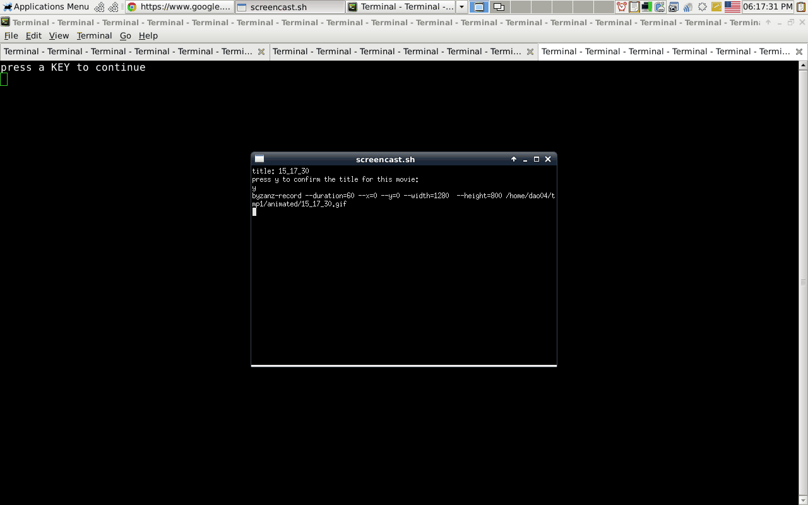

[](https://travis-ci.org/brownman/do_for_others_first)

#do_for_others_first
===========
#greatness is on the move

todo
==
- choose langueges through a checkbox dialog
- optionaly: update wallpaper for xfce - default: false


``` 
*** howto:
#sudo apt-get install git
#git clone https://github.com/brownman/do_for_others_first
#cd do_for_others_first
#./do_for_others_first.sh
```




## License
MIT: http://ofer-shaham.mit-license.org


